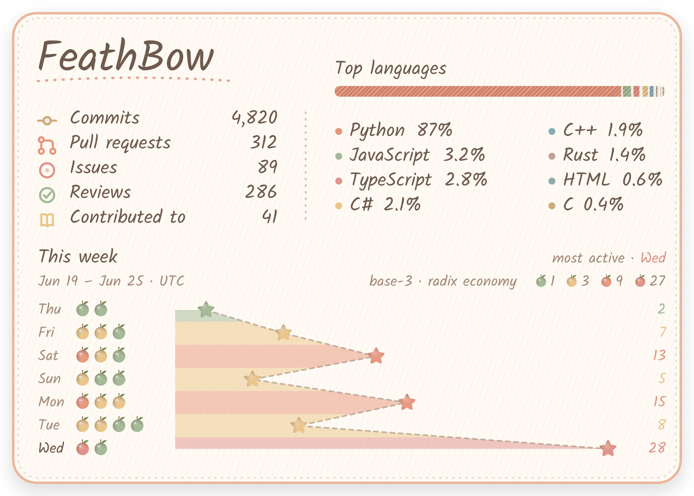
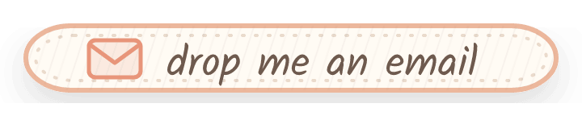

<h1 align="center">Hi, I'm FeathBow</h1>

  

  RA interested in <b>programming languages</b>, <b>AI</b>, and <b>software engineering</b>.

  <a href="https://github.com/FeathBow">
    <picture>
      <source media="(prefers-color-scheme: dark)" srcset="assets/stats-dark.png">
      
    </picture>
  </a>

  <picture>
    <source media="(prefers-color-scheme: dark)" srcset="assets/divider-dark.png">
    
  </picture>

<h3 align="center">Let's connect</h3>

  Thinking about <b>research internships</b>, a <b>PhD</b>, or a <b>postdoc</b> around <b>PL · AI · SE</b>? 
  Glad to swap notes and help out where I can.

  If you'd like to talk about music, drawing, cooking, or life, 
  or just to make new friends, feel free to drop me an email :)

  <a href="mailto:feathbow@gmail.com">
    <picture>
      <source media="(prefers-color-scheme: dark)" srcset="assets/email-dark.png">
      
    </picture>
  </a>

